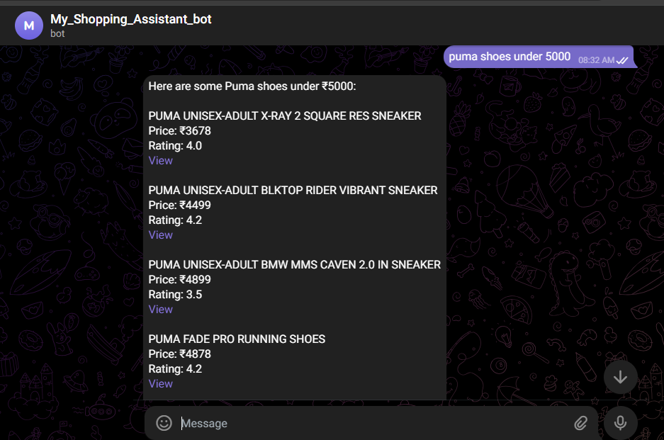
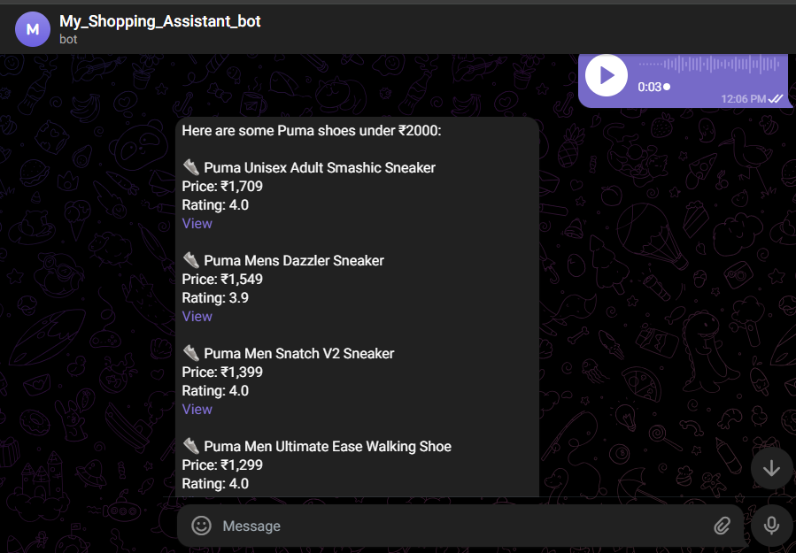

# Telegram AI Shopping Assistant

An AI-powered Telegram bot that accepts both text and voice inputs to generate product recommendations using automation workflows and AI models.

---

## Features

- Text-based product search via Telegram
- Voice input support (speech-to-text processing)
- AI-powered product recommendations
- Real-time product data retrieval using APIs
- Automated workflow orchestration using n8n
- Structured response formatting (price, rating, links)

---

## Demo

### Text Input

User Query:  
puma shoes under 5000  

Output:

---

### Voice Input

User sends voice message → converted to text → processed → response generated  

---

## Workflow Overview

1. Telegram Trigger receives user message or voice input  
2. IF node determines input type (text or voice)  
3. Voice input is converted to text  
4. Data is processed using Python node  
5. External API is called using HTTP Request  
6. AI Agent (Gemini) processes and structures the response  
7. Response is sent back to Telegram user  

---

## Workflow Screenshot

.png)

---

## Tech Stack

- n8n (Workflow automation)  
- Google Gemini AI  
- Telegram Bot API  
- Python (data processing)  
- HTTP APIs  

---

## Setup Instructions

1. Clone the repository  

2. Import workflow into n8n:  
   workflow/telegram-shopping-bot.json  

3. Configure credentials in n8n:  
   - Telegram Bot Token  
   - Gemini API Key  
   - External API keys (if used)  

4. Execute workflow  

---

## Usage

- Send a text query like:  
  "nike shoes under 3000"  

- OR send a voice message with your query  

The bot will return:  
- Product name  
- Price  
- Rating  
- Purchase link  

---

## Key Concepts Demonstrated

- AI agent integration  
- Multi-modal input handling (text + voice)  
- Workflow automation  
- API integration  
- Real-time data processing  
- Conversational AI system design  

---

## Notes

- API keys are not included for security reasons  
- Add your credentials inside n8n before running  
- Do not upload secrets to GitHub  

---

## Author

Vishnu Vardhan B  
GitHub: https://github.com/vishnu25832  

---

## License

MIT
